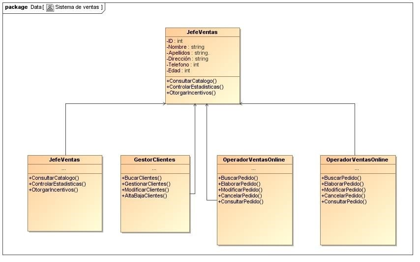
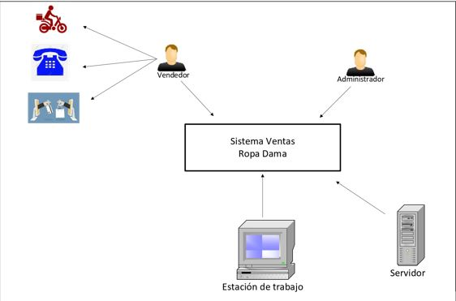

#  ELEGANT
Se describen en forma específica los requerimientos necesarios para el desarrollo de un sistema que administre información de ventas. Se señalará la función del sistema y la forma de cómo cumplirá con los objetivos de los requerimientos indicados para el desarrollo del sistema. Se mencionará cada uno de los procesos a seguir para la manipulación del sistema y como cubrirá las necesidades del proyecto.

**Personal**
| Nombre             | Luis Salazar| 
|-------------------|-------------|
| Rol  | Representante de MC Comunicaciones |
| Categoría profesional.| Gerente      | 
| Responsabilidades. | Seguimiento desarrollo del proyecto.| 
| Información de contacto      | direccion@mccomunicaciones.mx  | 

| Nombre             |EDGAR ALEJANDRO JARQUIN FLORES| 
|-------------------|-------------|
| Rol  | Usuario experto. |
| Categoría profesional.| Departamento sistemas      | 
| Responsabilidades. | Jefe de sistemas| 
| Información de contacto      | ejarquin@mccomunicaciones.mx| 

**Funciones del producto.**

El departamento de ventas dispone de tres servicios distintos de ventas: las ventas a domicilio del cliente mediante un representante de ventas. Las ventas a través de una de las operadoras de la empresa, con la que el cliente solicita sus pedidos a través del medio telefónico y por último, se dispondrá de servicios web para poder hacer los pedidos de esta forma, considerando al cliente como cliente online.

**Elaborar pedido.**

Un representante de ventas o una operadora pueden elaborar pedidos o bien para sus propios clientes (caso del representante) o bien para cualquier cliente (caso de la operadora). Los pedidos figurarán en estado de elaboración y eliminar a petición del cliente o modificar las líneas del pedido, ya sea en cantidades de productos como en los distintos productos de que consta el pedido.

**Elaborar pedido búsqueda.**

El representante de ventas o la operadora, después de registrarse en el sistema mediante el usuario y la contraseña pueden invocar el caso de uso elaborar pedido, aunque en el caso del representante de ventas únicamente podrá elaborar pedidos de los clientes que tenga asignados. Se introduce el cliente y se muestran los pedidos que tiene pendientes si los hay. Se puede modificar, eliminar o realizar nuevos pedidos.

**Descripción del interfaz.**
| Datos del representante de ventas| | 
|-------------------|-------------|
| Código. | Código correlativo, automático y autogenerado por el sistema del representante de ventas. No es editable por el usuario. |
| Nombre.| Nombre y apellidos del representante de ventas. No es editable por el usuario. | 
| Datos del cliente| | 
|-------------------|-------------|
| Código del cliente | Código correlativo, automático y autogenerado por el sistema del cliente. No es editable por el usuario.| 
|RFC | Número de documento de identidad o registro único de contribuyente |
|Nombre.|Nombre del cliente. No es editable por el usuario.|
|Persona de contacto|Persona asignada por el cliente para la venta|
|Teléfono contacto.|Teléfono celular de la persona asignada por el cliente para la venta.|
|Calle.|Nombre de la calle del domicilio del cliente.|
|Localidad.|Municipio o ciudad donde se ubique el domicilio cliente.|
|Estado.|Estado donde se ubique domicilio cliente.|
|Pedidos en elaboración||
|-------------------|-------------|
|Código.|Código correlativo, automático y autogenerado por el sistema de pedido. No es editable por el usuario.|
|Fecha elaboración.|Fecha en que se generó el pedido. No es editable por el usuario.|
|Pedidos enviados al almacén.||
|-------------------|-------------|
|Código.||Código correlativo, automático y autogenerado por el sistema de pedido. No es editable por el usuario.|
|Fecha elaboración.|Fecha en que se generó el pedido. No es editable por el usuario.|
|Fecha llegada almacén|Fecha en que el pedido fue recepcionado en almacén. No es editable por el usuario.|
|Botones de acción: gestión de clientes, buscar, nuevo, modificar, cancelar, pedido, consultar pedido y salir.||
|-------------------|-------------|
|Gestión de clientes|Permite realizar búsqueda por código del representante de venta, utiliza la información ingresada en la caja de texto.|
|Buscar.|Permite realizar búsqueda por código cliente, utiliza la información ingresada en la caja de texto.
|Nuevo|Abre la interfaz elaborar de pedido nuevo, sin datos con las casillas abiertas para ingresar datos.|
|Modificar.|Abre la interfaz elaborar de pedido modificar, con datos con las casillas abiertas para modificar los datos del pedido.|
|Cancelar pedido|Abre la interfaz elaborar de pedido cancelar, con datos con las casillas abiertas para cancelar el pedido de un producto o el pedido en general.|
|Consultar pedido|Abre la interfaz elaborar de pedido-consultar, con datos con las casillas cerradas informar el estado del pedido.|
|Salir|Cierra la ventana actual y regresa a la ventana anterior.|

**Diagrama de clases**

**Estructura y arquitectura del software.**

**Diseño de interfaz.**

